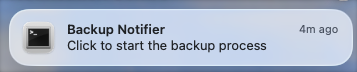
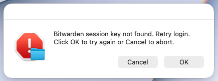

# Minimalistic Bitwarden Password Backup Tool

[](https://opensource.org/licenses/MIT)


We all love [Bitwarden](https://bitwarden.com/). However, sometimes we just don't feel comfortable storing all the passwords on the cloud. Although Bitwarden stores local cache for 30 days when you go offline, it always gives a peace of mind if you know you have a local backup copy in your hard drive. Bitwarden Password Backup Tool does exactly that.

This is a robust, automated shell script to backup your Bitwarden vault on macOS. It utilizes [bitwarden-cli](https://bitwarden.com/help/cli/) to authenticate and automatically store backups, exporting a **portable (password-protected)** JSON file that you can import back to Bitwarden or other supported password managers (e.g. KeePassXC). You can even set up reminders with [terminal-notifier](https://github.com/julienXX/terminal-notifier) to send notifications when it's time for backup.

No docker, no tons of dependencies, no complexities. Just a simple, transparent, minimalistic shell-script backup tool for your local storage.

## Features

* **GUI Prompts:** Uses macOS native dialogs to request the Master Password—no typing passwords into the terminal.
* **Portable Backups:** Creates password-protected JSON exports that can be imported into *any* Bitwarden account (unlike account-restricted backups). The backup files are protected with the same master password for your Bitwarden vault.
* **Automated Rotation:** Automatically keeps only the last `N` backups (configurable) to save disk space and prevent potential security threats.
* **Reminders:** Uses `terminal-notifier` to alert you when it's time for backup (frequency configurable).

## How to Use
Type this command in your terminal:
```
bw-backup
```
or, if you don't want to use the alias, `cd` to the project folder and type:
```bash
./bw_backup.sh
```
And that's it! A dialog window will appear requesting your Bitwarden master password, once you enter the correct password, it handles everything and stores the encrypted JSON file in the directory of your choice. You will receive a notification after ~20 seconds that confirms the backup.

If you set up a reminder with `crontab` (detailed below), you will receive a notification regularly that looks like this:



Clicking on it will bring out a dialog requesting your master password. Enter the password and you are good to go.

A little GIF showing you how it's done:


## Setup

### Prerequisites

You need the following tools installed on your macOS system. You can install them easily via [Homebrew](https://brew.sh/):

```
brew install bitwarden-cli terminal-notifier
```

### Configuring `.env` file

First, clone this repository:
```
git clone https://github.com/kckhchen/bitwarden-backup.git
```

Copy the `.env.example` file in the repository and rename it `.env` before configuring. Log in to Bitwarden on your web browser and follow the steps from the [official documentation](https://bitwarden.com/help/personal-api-key/#get-your-personal-api-key) to get your API key. Paste your `client_id` and `client_secret` in the corresponding fields. Other configurable variables are listed here:

| Name              | Description                           | Default                      |
| ------------------| ------------------------------------- | ---------------------------- |
| `BW_CLIENTID`     | Your `client_id` from Bitwarden       | none                         |
| `BW_CLIENTSECRET` | Your `client_secret` from Bitwarden   | none                         |
| `BACKUP_DIR`      | Directory to store your backup files  | `$HOME/Backups/Bitwarden`    |
| `LOG_FILE`        | Path to the log file                  | `/tmp/bw_backup.log`         |
| `MAX_ATTEMPTS`    | Maximum attempts of password before the process abort | 5            |
| `KEEP_LAST_N`     | Number of backups to keep             | 3                            |

### Installation

This repository comes with a `setup.sh` shell script. Use the following commands to quickly set things up.

```bash
chmod +x ./setup.sh
./setup.sh
```

`setup.sh` will check dependencies, create the backup directory, validate configurations, and make sure your `.env` file is secure. Specifically, it runs `chmod 600` for your `.env` to make sure only you, the owner, can access the sensitive information inside.

The setup script also enables the command `bw-backup` for you to backup your file manually in the terminal (you can opt out of it, of course, but you'll need to run the script manually).

### Scheduling the Backup (Optional)

Besides running the script manually, you can set a cron job for `backup_alerter.sh` to remind you. First, open the `crontab` file with 
```
crontab -e
```
Then use any cron expression to set up the frequency you want to be reminded. For example, to have cron remind you on the first day of every month at noon, use
```
0 12 1 * * /path/to/repo/backup_alerter.sh
```

For more crontab setting you can refer to [crontab guru](https://crontab.guru/).

## How to Restore

If you ever need to use your backup:

1.  Log in to your [Bitwarden Web Vault](https://vault.bitwarden.com/).
2.  Go to **Tools** → **Import Data**.
3.  Select format: **Bitwarden (json)**.
4.  Choose the `Backup-YYYY-MM-DD.json` file generated by this tool.
5.  **Important:** Because the file is encrypted, Bitwarden will ask for the password you used when the backup was created (which is your master password).

Or you might want a cold-storage in KeePassXC:
1. Open the KeePassXC application.
2. Select **Import File**, choose **Bitwarden (.json)**.
3. Use **Browse** to locate your backup and enter your master password in the **Password** box.
4. Encrypt the database with your password.


## ⚠️ Security Disclosure

This tool creates **password-protected** backups using the official `bw export` command.

To create a backup that is portable (password-protected), we must pass the password to the CLI using the `--password` flag. This means that when this particular line of code is running, it may be visible by malware or other users who are actively monitoring process lists. **Do not run this script on a shared computer or multi-user server** where other users might be monitoring processes.

Unfortunately currently there's no way around this limitation as the `bw export` doesn't support reading passwords from an environment variable.

Alternatively, if you do not plan to import your password to other Bitwarden accounts or password managers, simply look for the line in `bw_backup.sh` with the command `bw export` and delete the `--password` argument:
```bash
bw export --format encrypted_json --output "$BACKUP_FILE"
```

This will create an [account-restricted export](https://bitwarden.com/help/encrypted-export/) that can only be imported to the same account that generated the encrypted export. You WILL NOT be able to use this backup elsewhere other than your Bitwarden account.

If you prefer, you can also export unencrypted JSON by modifying the same line: Remove the `--password` argument and change the `--format` to `json`.

```bash
bw export --format json --output "$BACKUP_FILE"
```

> [!WARNING]
Having your unencrypted password backups sitting in your local machine can be very dangerous.

## Technical Notes

### Log file

When the script runs, it will create a log file at `/tmp/bw_backup.log`. You can check the backup status here. You may also change the log file path.

### Possibility of full automation

Technically this can be achieved. However, not having to manually type in the master password to initiate the backup process means that the user has to store the master password in plain text as an environment variable, which is dangerous practice. For this reason, manually typing the master password via the secure OS prompt is the intended design.

### Known issue

For unknown reasons, sometimes even when the master password is correct, Bitwarden returns an empty session key string. A detection code block is included to capture this issue and prompt a re-login automatically.



Generally, 1 or 2 re-logins solve the issue.

---

*Disclaimer: I have no association with Bitwarden. This is purely an interest project.*